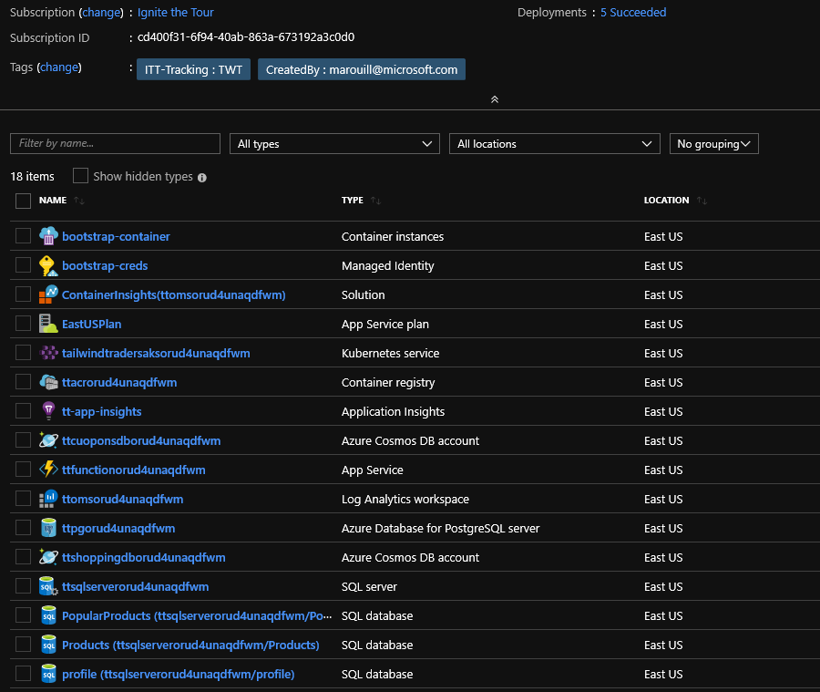
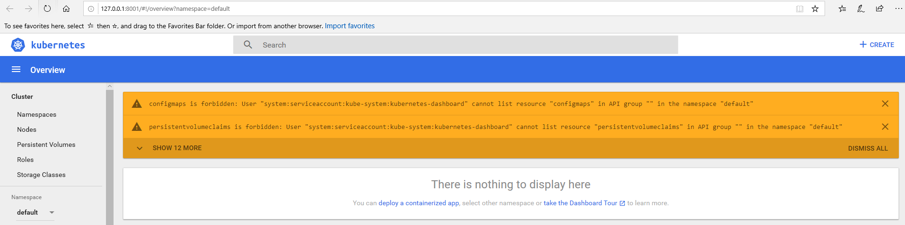
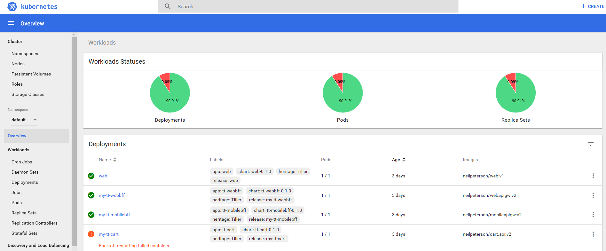
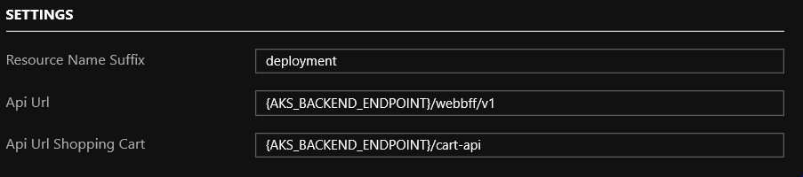
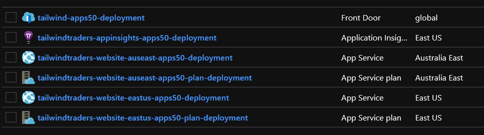

# Taking Your App to the Next Level with Monitoring, Performance and Scaling

## Deployment

Along the way, you will be asked to store a number of variables to make it easier to follow along with the demo scripts.  Before starting out, create a text file named variables.txt and pre-fill it with the following:

```
AKS_BACKEND_ENDPOINT=
AKS_RESOURCE_GROUP=
AKS_NAME=
FRONTEND_RESOURCE_GROUP=
AZURE_FD_ENDPOINT=
```

As we progress through the Deployment steps, we will update this list with appropriate values to be used later in the demo scripts.

First you will need to [deploy the Tailwind Traders Reference Deployment to an AKS instance](https://github.com/neilpeterson/tailwind-reference-deployment#tailwind-traders-aks).  Be sure to select the "Deploy to Azure" button that is under the "Tailwind Traders AKS" heading.  Follow the instructions in the README of the above linked repo to obtain the url of the newly deployed Tailwind Traders website.  We will refer to this value later on as `AKS_BACKEND_ENDPOINT`, please store this value in your variables.txt file where it can be retrieved later.

You should end up with the following deployed resources, take note of the resource group that the backend was deployed to and the Azure Kubernetes Service name, we will use those values in steps that follow.  Store these values in your variables.txt where they can be retrieved later as `AKS_RESOURCE_GROUP` and `AKS_NAME`  respectively:



Demo 4 involves fixing an issue within Azure Kubernetes Services, we need to manually create the issue by performing the steps below.

Ensure that you have installed the [Azure CLI](https://docs.microsoft.com/en-us/cli/azure/install-azure-cli?view=azure-cli-latest) on your machine.

Login to the azure subscription which contains the deployed resources with:

```
az login
```

Retrieve your active accounts with:
```
az account list
```

Set the appropriate account (be sure to replace the entirety of `Subscription_Id` with the value of the subscription id containing your deployed AKS instance):
```
az account set --subscription Subscription_Id
```

Now we will attempt to access our AKS instance through the kubernetes dashboard using (be sure to replace the entirety of `AKS_RESOURCE_GROUP` and `AKS_NAME`  with the appropriate values):

```
az aks browse --resource-group AKS_RESOURCE_GROUP --name AKS_NAME
```

The dashboard will attempt to load but you should be met with permissions issues, this is by design.



Next, install kubectl and follow the instructions to make the program accessible to your `PATH` with:

```
az aks install-cli
```

Obtain the credentials to connect to your AKS instance with (be sure to replace the entirety of `AKS_RESOURCE_GROUP` and `AKS_NAME`  with the appropriate values):

```
az aks get-credentials --resource-group AKS_RESOURCE_GROUP --name AKS_NAME
```

Enable access to all services in the Kubernetes dashboard with:

```
kubectl create clusterrolebinding kubernetes-dashboard --clusterrole=cluster-admin --serviceaccount=kube-system:kubernetes-dashboard
```

Connect to the now accessible Kuberenetes dashboard with (be sure to replace the entirety of `AKS_RESOURCE_GROUP` and `AKS_NAME`  with the appropriate values):

```
az aks browse --resource-group AKS_RESOURCE_GROUP --name AKS_NAME
```

Select "Config and Storage" => "Config Maps" => "cfg-my-tt-cart", select "Edit" and copy the value for `HOST` to your variables.txt file so that it can be retrieved later, we will refer to this value as `HOST` in the Demo 4 script. Finally, edit out this value so that there is nothing there as shown below and select "Update":


Now we just need to restart the my-tt-cart deployment with:
```
kubectl scale --replicas=0 deployment my-tt-cart
kubectl scale --replicas=1 deployment my-tt-cart
```

You should be able to verify in the kubernetes dashboard that the cart service is broken in the dashboard (don't worry, we will fix it as part of demo 4)



Next, you will need to deploy the Apps50 specific Frontend resources provided by the "Deploy to Azure" button below:

[](https://portal.azure.com/#create/Microsoft.Template/uri/https%3A%2F%2Fraw.githubusercontent.com%2Fmicrosoft%2Fignite-learning-paths-training%2Fmaster%2Fapps%2Fapps50%2Fdeploy%2Fdeployment.json)

After selecting the subscription, resource group, and location or deployment, you will need to provide a unique value for the following setting:



`Resource Name Suffix` is a value that should consist of text only which is appended to the end of all created resources, ex: if you were to put "deployment" here, it would create the following resources:



Update the value of `FRONTEND_RESOURCE_GROUP` in variables.txt with the value used for the name of the resource group that the frontend resources were deployed to.

An azure front door instance will be deployed to the url:
"http://tailwind-apps50-" + `Resource Name Suffix` + ".azurefd.net"

Store the full value of this url to your variables.txt file as the value for `AZURE_FD_ENDPOINT`

The deployment can take up to 20 minutes to complete.  When it is finished you should see a set of resources similar to the picture above deployed into the resource group that you selected.

This deployment will purposely deploy a "broken" App Service instance of the Tailwind-Traders Frontend to East US and Australia East which we will fix in Demos 2 & 3.  

Before proceeding to the demos, ensure that you have a file which contains the following variables:

| Variable      | Description |           |
| -------------- | ------------| --------- |
| AKS_BACKEND_ENDPOINT      | The http endpoint to the backend AKS Services  | Required for Demos 2,3,4 |
| AKS_NAME   | The name of the AKS service deployed | Required for Demo 4 |
| AKS_RESOURCE_GROUP   | The name of the resource group that the AKS service is deployed to | Required for Demo 4|
| HOST   | The CosmosDB Endpoint used by AKS for the my-tt-cart service | Required for Demo 4 |
| FRONTEND_RESOURCE_GROUP      | The name of the resource group that the Frontend services are deployed to  | Required for Demos 2,3,4 |
| AZURE_FD_ENDPOINT      | The http endpoint to the Azure front door service  | Required for Demos 1,5 |


## Demos

To reset the demo, please refer to the [reset instructions](./demo-scripts/demo-reset.md).

The demos are set to but run in the following order:

* [Identifying the issue](./demo-scripts/demo1.md)
* [Enabling Application Insights in your Application](./demo-scripts/demo2.md)
* [Finding and Fixing Failures with Failure Analysis in Application Insights](./demo-scripts/demo3.md)
* [Monitoring and Fixing Failures in AKS using Azure Monitor for Containers](./demo-scripts/demo4.md)
 