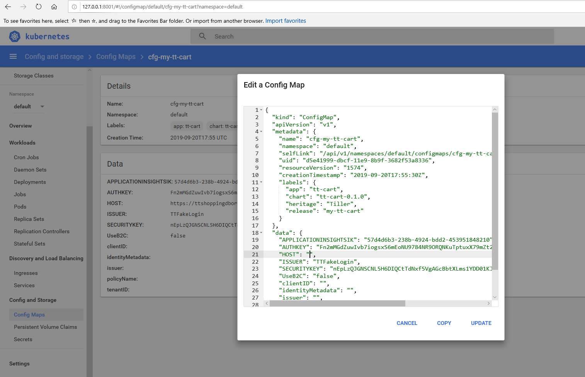

# Reset to initial state

## Front-End

* We're working with the Resource Group `FRONTEND_RESOURCE_GROUP` from variables.txt.
* Ensure all AppService in that group are started
* Ensure that the `AZURE_FD_ENDPOINT` backend pools point to `AUSTRALIA_EAST_SITE` and `EAST_US_SITE `.
* For `AUSTRALIA_EAST_SITE` and `EAST_US_SITE `
    * Go to Configuration, ensure that `ApiUrl` is set to `http://AKS_BACKEND_ENDPOINT/webbff/v1`
    * Go to Configuration, ensure that `ApiUrlShoppingCart` is set to `http://AKS_BACKEND_ENDPOINT/cart-api`

## Back-end
* Run `az aks browse --resource-group AKS_RESOURCE_GROUP --name AKS_NAME` in a console using values from variables.txt. 
* Set the `Config Maps` for `cfg-my-tt-cart-cart-api`. Ensure `HOST` is empty.

*  Restart the my-tt-cart deployment with:
```
kubectl scale --replicas=0 deployment my-tt-cart
kubectl scale --replicas=1 deployment my-tt-cart
```

TODO